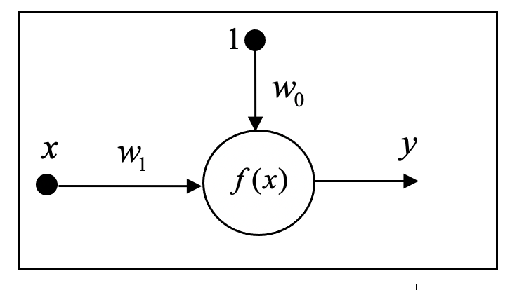
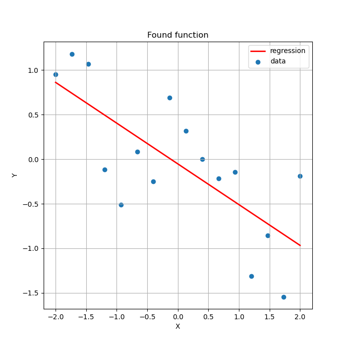

# Лабораторная работа № 6 по ТСиСА
## Архитектура простейшего нейрона:

## Полученные точки с заданной ошибкой:


## Найденная аппроксимирующая функция:


## Полученные веса нейрона:
```
Optimal weights:
w0 = -0.0529747860413472
w1 = -0.45695695695695693
Linear regression:
y = -0.45695695695695693x + -0.0529747860413472
```